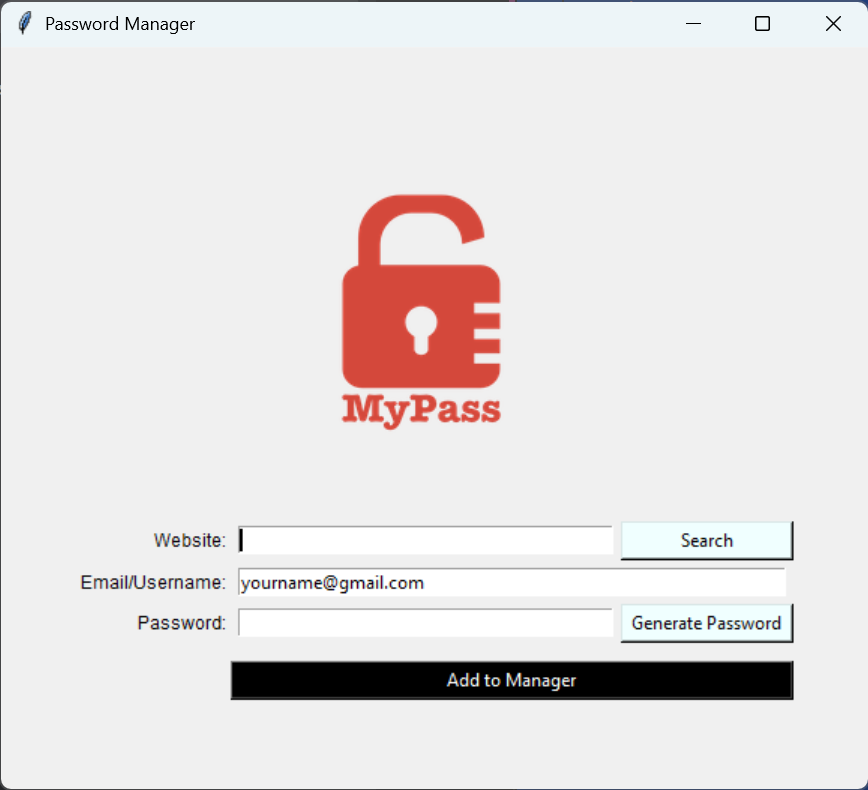

# Password Manager (Tkinter)

A simple desktop password manager built with Python and Tkinter.
It lets you **generate strong passwords**, **save site credentials** to a local JSON file, and **search** for saved entries—right from a tiny GUI.

> ⚠️ For personal/learning use. This app stores credentials in a local JSON file (`data.json`) **unencrypted**.

---

## Features

* 🔐 **Password generator** (copies to clipboard automatically)
* 💾 **Save credentials** per website → `data.json`
* 🔎 **Search** by website and display saved username/password
* 🖼️ Lightweight GUI with Tkinter (supports a `logo.png`)

---

## Preview

Add `logo.png` to the project root to see the logo in the window.



```

```

---

## Requirements

* Python 3.10+ (works on macOS/Windows/Linux)
* Packages:

  * `pyperclip` (clipboard support)

Everything else uses the Python standard library (`tkinter`, `json`, `secrets`, `string`).

### Install deps

```bash
pip install -r requirements.txt
```

**requirements.txt**

```
pyperclip>=1.8.2
```

---

## Run it

```bash
python main.py
```

Files expected in the same folder:

* `main.py` (your code)
* `logo.png` (optional; used by the UI)
* `data.json` (created automatically after first save)

---

## How it works

* **Generate Password**

  * Click **Generate Password** → creates a random string using letters, digits, and punctuation via `secrets.choice`.
  * The password is **auto-copied** to clipboard and inserted into the password field.

* **Save Credentials**

  * Fill **Website**, **Email/Username**, **Password** → click **Add to Manager**.
  * Credentials are saved to `data.json` under the website key:

    ```json
    {
      "example.com": {
        "email": "you@example.com",
        "password": "S3cure!Pass"
      }
    }
    ```
  * If `data.json` doesn’t exist, it’s created. If it exists, the entry is merged/updated.

* **Search**

  * Enter a website and click **Search** to display the stored username and password in a dialog (if present).

---

## Keyboard/UX tips

* The **Website** field is auto-focused on launch.
* After saving, the app clears the website/password fields and returns focus to **Website**.

---

## Security notes (important)

* `data.json` is **plain text**. Anyone with access to the file can read credentials.
* Clipboard contents can be read by other apps while present.
* This project is for learning or low-risk local use. For sensitive accounts, consider:

  * disk encryption (FileVault/BitLocker),
  * storing the JSON on an encrypted volume,
  * or evolving this project to use an encrypted format (e.g., Fernet/AES) and a master password.

---

## Common issues

  Make sure `logo.png` exists in the same folder as `main.py`, or remove the logo lines:

  ```python
  logo_img = PhotoImage(file="logo.png")
  canvas.create_image(125, 125, image=logo_img)
  ```
---

## Project structure

```
.
├─ main.py
├─ data.json        # created after first save
├─ logo.png         # optional
└─ requirements.txt
```

---

## Roadmap (nice-to-haves)

* Mask/unmask password field toggle
* Password length/charset options
* Basic input validation on email/URL
* Duplicate-site warning
* **Encrypted** vault with a master password
* Export/import flow
* Simple unit tests

---

## License

MIT (or your preferred license). Add a `LICENSE` file if you want others to use/modify it.

---

## Acknowledgments

Built with Python’s standard libraries (`tkinter`, `json`, `secrets`) and `pyperclip` for easy clipboard support.
